## June 15 : Research finished !

I am finally done with all my research, took major decisions for the final product and finished my components list with Deepseek's help !

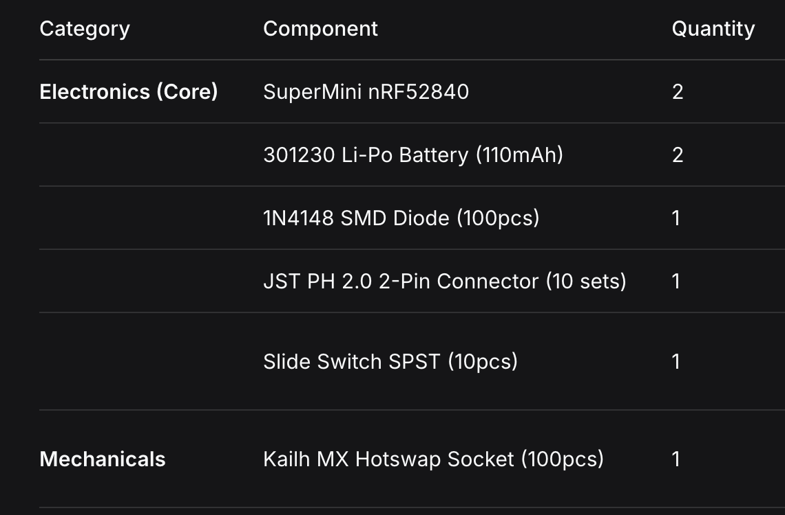

### What I've decided on :

     - The keyboard will be a wireless split keyboard
     - It's layout will be a standard Corne : 42 total keys - 3x6 Switch matrix and 3 thumb keys per side
     - It will use a 110 mAh battery per side
     - The microcontroller will be a Supermini nrf52840 chip
     - It will additionally also have 2 OLED's : One to display the Layer (im a kb warrior lmao) and one for battery percentage and connectivity
     - It will of course have an off/on switch
     - I will be using cherry mx switches, WHICH ARE REALLY EXPENSIVE - i never would have thought that a cherry mx official switch cost almost 1$/switch
     - I will also use hotswapping adapters so I dont have to permanently stick with one type of switch
     - I will 3D print the case

## June 16 : Schematic done !

Done with Schematic ! It was a bit hard to figure out some things, find some footprints and symbols, and expecially with the wiring
and the wierd symbols for my microcontroller - also some of the components did'nt have symbols so i had to improvise.
It was hard to find out which symbols and footprints to use, but it was fun to see concepts i learned in physics class like voltage dividers with resistors being used !

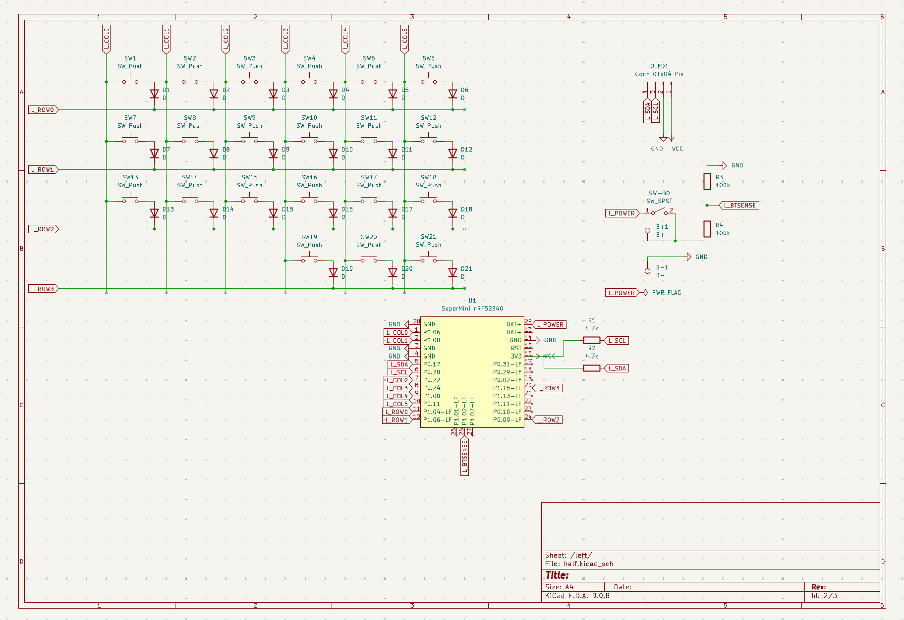

## June 17 : PCB part 1

I was finished arranging and wiring my PCB, and ran DRC, when Disaster struck - my footprint for the microcontroller was wrong !
I had to start again with a new footprint, and delete all the wires going there. And to add to my misery, I had forgotten to click unpause on my Recording, and lost next to 2 HOURS of work.
Here is the current state of my PCB :

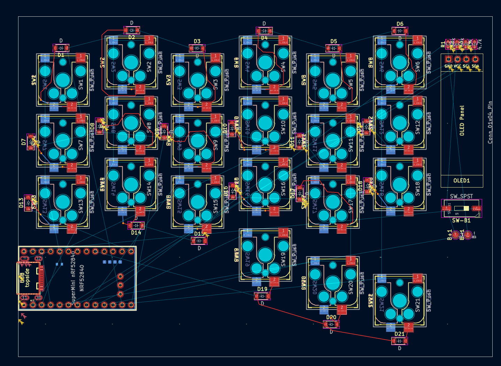

## June 18 : PCB finished !

I had forgot to mention yesterday : I had made a revision to my PCB and Schematic!

I was before using one Schematic with two hierarchy sheets like the blueprint tutorial said, but that was growing troublesome with the Global labels,
and i would have had to wire the PCB twice, or take some long bypass that might not work in the end. Instead, i made a major decision for the final project :
I instead of putting both Sides in one project realized that I could just make the PCB for one half, then FLIP it over ! this was a major revelation, as this meant I only needed to design the schematic
and the PCB ONCE instead of twice, sparing me effort.

After realizing this, i started with the PCB :

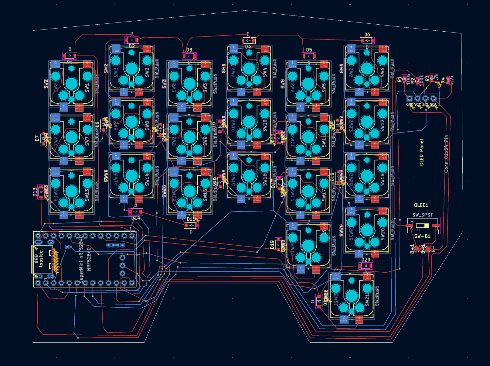

I had really not wanted to use via's, but with the amount of components and wires on the PCB, it was impossible not to,
expecially cause i am still an amateur - this is only my second PCB ! It was also because of the design of the diode's and the hotswap sockets,
so it was rather unavoidable. I finished wiring though, and also made the Outline fo the board fit the board a bit better - im proud that im done now though !
Next time i hope i can do it better with the experience from this, and im a bit sad at the amount of vias used.

## Still June 18 :D :

I added mounting holes to my PCB cause i realized that trying to make a case that snaps or slides shut with some mechanism that still holds the PCB
safe would be rather troublesome, and decided to cut my losses and add 4, at the approximated corners of my PCB

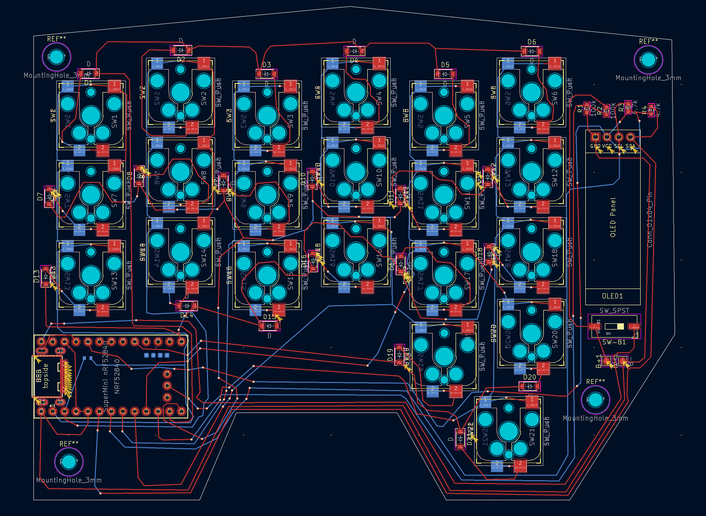

I also started finding the CAD 3D models for my components and adding the 3D Models to their corresponding footprints
in KiCad itself, which will make is much easier than painstakingly hand-positioning them in a 3D modeling tool like OneShape one by one.
I think I have all the Footprints :

The 3D models for the battery test points, diodes, and resistors were already built in to KiCad, so i didnt have to do those,
but for the following :

    - Supermini nrf52840 (this took so long to find, as all of the one that were popping up first either were very vague approximations or were missing pin holes or other things)
    - Cherry MX Switches (There was a bit of trouble with this as well, as i got confused by two pins that are apparently only for support and can be snipped off - that was *wierd*)
    - Kailh MX Hotswap Sockets (these were easy to find, but it was a bit annoying to try and figure out on which side and how these are to be positioned on the PCB)
    - the OLED (i had this from the Hackpad already, so this was easy :D)

For each of these, i had to import the 3D model into KiCad and then position them so that the pins or protrusions go into the holes of the PCB, which was annoying, but better than doing that for EVERY component.

Here is a pic of the final PCB from the built in 3D viewer in KiCad:

#### Top

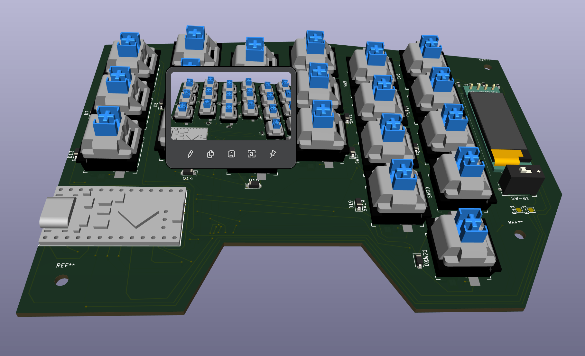

#### Bottom

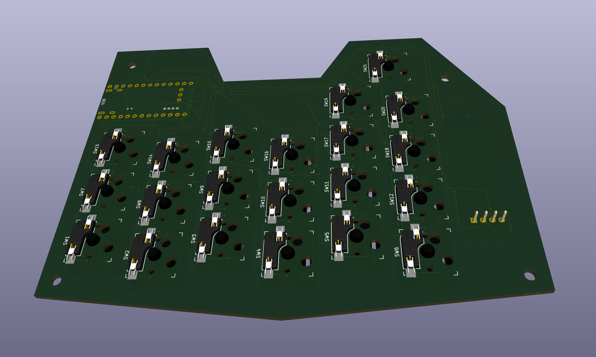

## June 27 : 3D Modeling - Case Top

After a long time of being lazy and working on the schematic for my other current project **_AquaPuck_** (_Psstt ... U should check it out ! Its also on Stardance ..._)
im back !

I started working on the 3D modeled Case for my SplitBoard ! I had a bit of experience from the **_PandaPad_** (My hackpad stardance project) for this part, only difference is, the Hackpad was 6 keys and 2 other Parts -
compared to that this thing is **MIND BLOWING** !

So what i did today was first plan - Just like for the PandaPad, i decided to use just 2 parts :

- The Case Bottom (A kind of hollow shell with space for the PCB)
- The Case Top (Basically a flat top for the Case Bottom with holes where the switches and screen or other components can poke through)

For now i decided to start with the Case Top, as the Bottom would be a lot complexer than the Top. Im realzing now that could be a mistake.

Anyway, to make the Top, this is what i started with - the 3D model for my PCB :

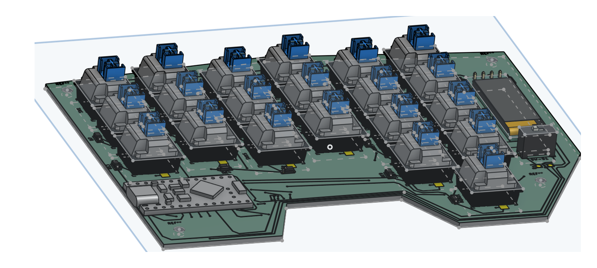

I started counting the components that would poke through - these were :

- The Keyswitches
- The Power Switch
- The OLED Screen
- The screws

So i started drawing cutouts for all of them :

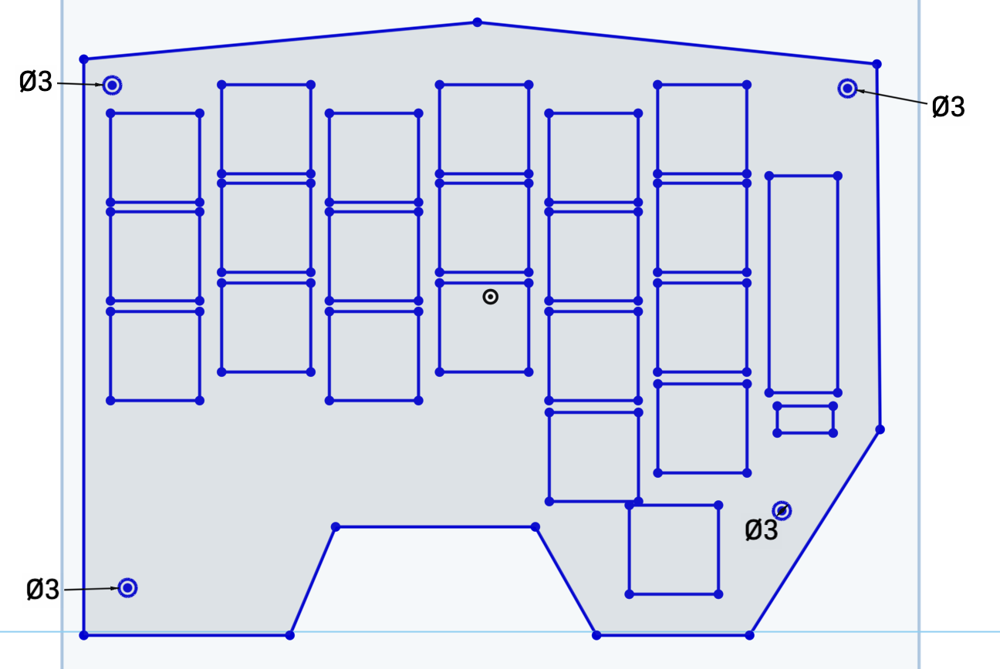

This is just the first sketch with cutouts, as i will have to make the entire thing bigger later (this is currently only as big as the PCB - Since this attaches to the Case itself it will need to be as big as the case - and the case walls will also have thickness, get it ?)

After extruding (just for show !) :

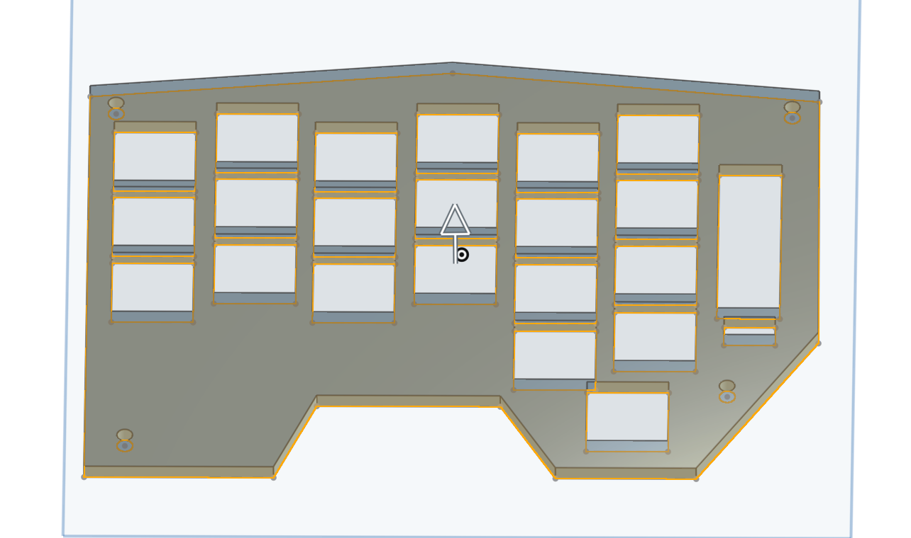

## June 29 : 3D Modeling done !

So, after a whopping 4 HOURS of work, i have the 3D Models for both sides of the Case done :

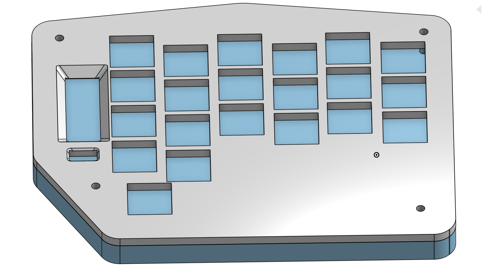

Basically i took the outline of the PCB as a reference, made a second outline that was bigger, less exact, etc. and then added mounting holes and a cutout for the USB-C port 
of my microcontroller

I also made it look good by rounding off corners, making the final outline a bit more bigger and less hugging the shape of the PCB.

I also polished the Case top in the same way.

Anyway, all i have left to do is set up the GitHub Repo and README
