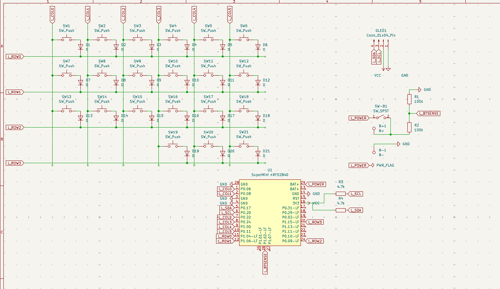
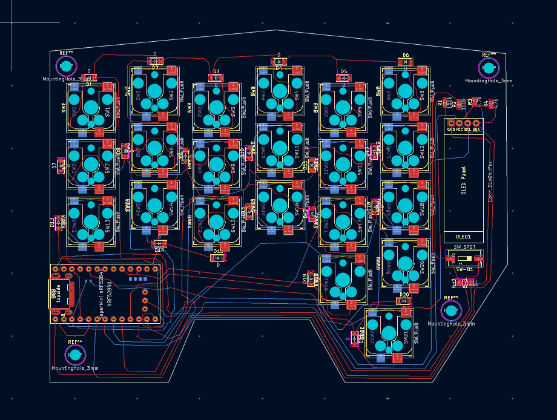
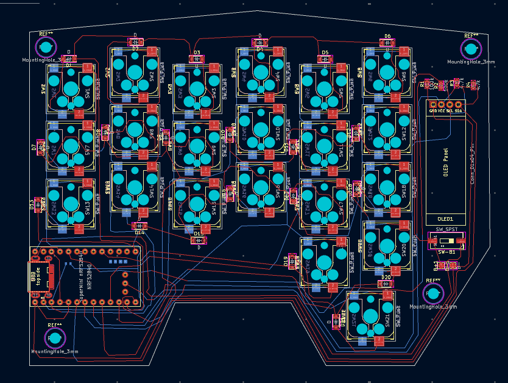
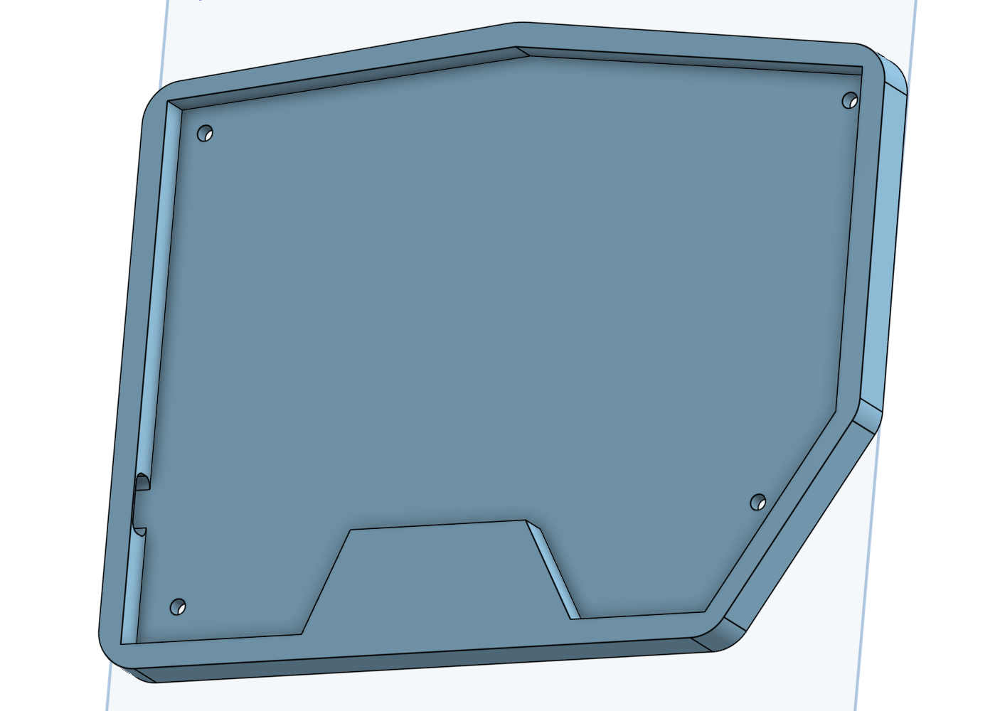
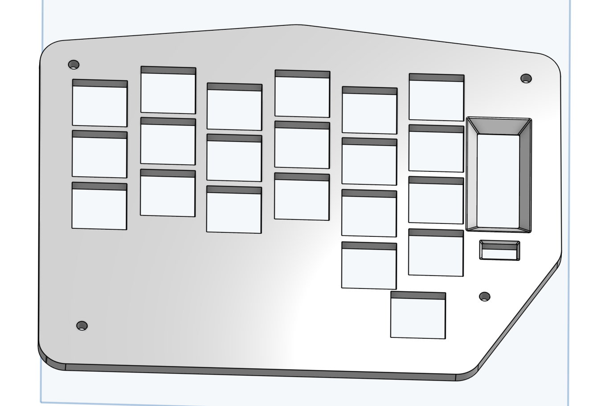
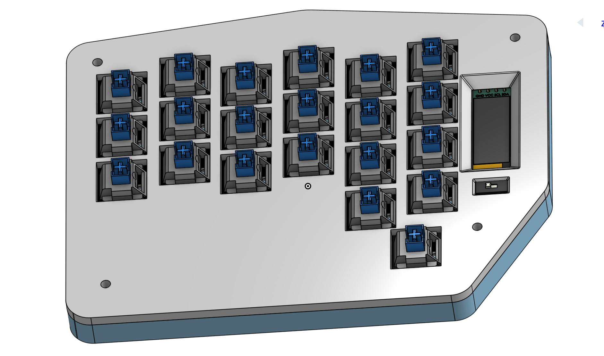
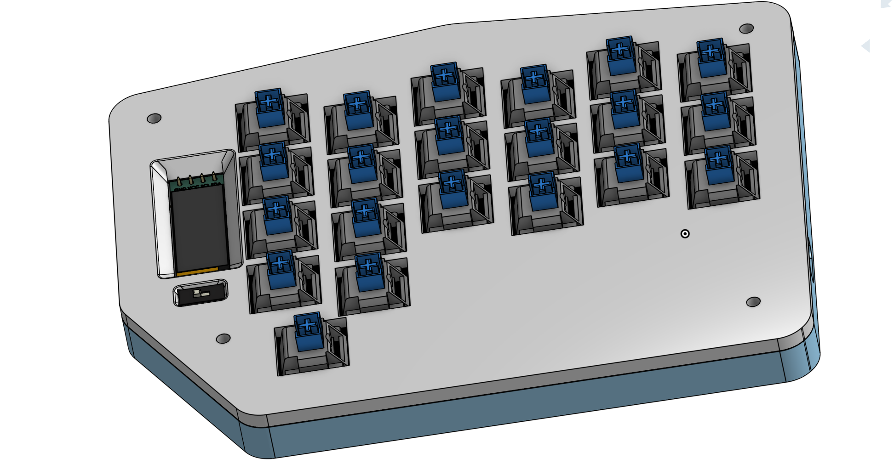
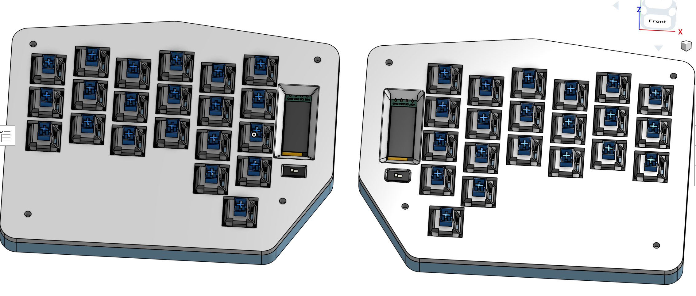

# Splitboard - a custom, built from scratch wireless corne split keyboard. Built for Stardance, to qualify for Outpost.

Splitboard is a wireless split keyboard built by ME - Panda (also known as Adnan)

You see, my dad has had a dygma raise split keyboard since like 4 years, and i thought it looked REALLY cool, and wanted to get one -
till i saw the price - the thing was whopping **_200 DOLLARS_** ! So i thought to myself - why not build one myself ?

By the time this event rolled around, i was already getting tired of my very *anti-*ergonomic apple magic keyboard, and thought
that this project would be perfect, expecially cause of the experience with keyboards i got from the Hackpad mission.

That is how the **Splitboard** was born.

## Components :

Since this keyboard was made completely from scratch, i first will tell you whats its made of :

The Split Keyboard has 2 halves, with each having :

- 21 Keys (3x6 matrix with 3 thumb keys) - in the classic Corne layout
- One OLED (blue, since thats myt fav color)
- A supermini nrf52840 microcontroller - this is a cheap nice ! nano v2 clone, a wireless chip made excpecially with keyboards in mind
- A 110 mAh Battery (should last weeks with my setup)

So this is the Schematic with all mentioned components :

## Schematic :

As you can see, i dont like wires :D

## PCB :

left side :

right side :

Although the initial plan was to make a _reversible_ PCB that i would just turn 180 degrees, i decided to make my keyboard not symmetric - which means i cant just turn it around, instead i have to make two seperate PCB's

## Case :

You can view it interactively on OnShape in your Browser ! : https://cad.onshape.com/documents/4401902cdc607732e38adc1c/w/b44e538c7538a5811b6e646c/e/3efcd232ff04d945eef59e16?renderMode=0&uiState=6a440a2cf26d36c1903a4b4f

For the case, i decided to use just two parts :

- ### A Case Bottom :

  This just holds the PCB and components for my keyboard

  

- ### A Top Plate :
  This will be screwed on to the base, and has holes for the components that need to look out to poke out
  

## Assembly :

There will be a such Bottom and Top for both halves of the keyboard, and it will then be assembled like this :

Then Keycaps will be pressed on to the switches.

This will be done on both sides :

In the end it will look like this :

## Firmware :

Because i had to make the firmware extremely fast for outpost, im just making a completely boring, standard corne keyboard firmware with ZMK

## Costs (BOM) :

I will buy everything except PCB from Aliexpress

2x supermini nrf52840 : 15 $
2x 110 mAh LiPo battery : 5 $
1N4148 SMD Diodes : 2 $
Kailh MX Hotswap sockets : ~ 7 $
42 x Cherry MX Switches : ~ 40 $
42 x Cherry MX Keycaps : 25 $
2 x 0.91" OLED Display : 6$
4.7kΩ SMD resistors : 1 $
100kΩ SMD resistors : 1$
SPST slide switches : 0.50 $
JST PH 2.0 2-pin connector (for battery) : 1 $
M2 standoffs + screws kit : 2 $
8mm self-adhesive bumpons (less glide) : 2 $
PCB from JLCPCB : 20 $
Shipping (Aliexpress and JLCPCB) : 15 $

**==IMPORTANT==** : This BOM is NOT accurate ! Check the actual BOM.csv file in the main branch

Total : ~ 115$

I would add another 15 - 20 dollar buffer since something is bound to go wrong, so in the end it would be around 160 dollars.
